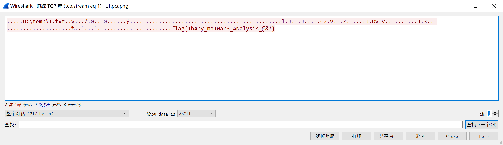

# malware 1 solution

## 1

利用 wireshark 分析 L1.pcapng，打开文件后，依次点击“分析-追踪流-TCP”流，选择“流 1”，即可找到 flag 明文存放在数据包中：

```
flag{1bAby_ma1war3_ANalysis_@&*}
```

wireshark 附图：


## 2

也可以直接搜索 L1.pcapng 文件：

```
$ strings L1.pcapng | grep flag
flag{1bAby_ma1war3_ANalysis_@&*}
```
