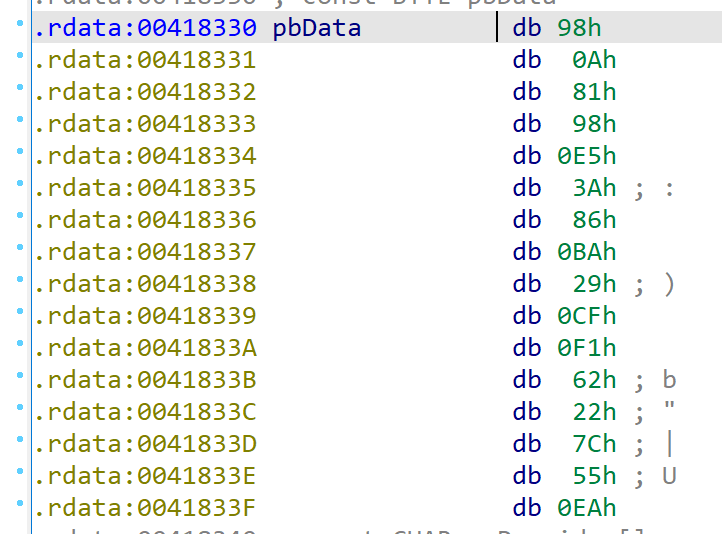

# malware 2 solution

主要思路是逆向 exe 文件，根绝代码分析函数的作用，找到其中的 socket send/recv 函数，再配合流量问价来分析行为，找到 flag。

## 初步分析

WinMain 是 exe 的入口函数，很简单：

```
int __stdcall WinMain(HINSTANCE hInstance, HINSTANCE hPrevInstance, LPSTR lpCmdLine, int nShowCmd)
{
  sub_403610();
  return 0;
}
```

继续分析 sub_403610 函数的代码。while 循环中进行 socket 数据交互，初步推断 sub_402C00 是发送初始 buf。if 结构内部，每一轮 for 循环完成一次 socket 数据收发。sub_402D40 函数进行 socket send，sub_401B70 函数进行 socket recv，sub_405444 函数清理 i，也就是 socket buf，准备下一轮连接。

sub_402CD0 在一次收发之后关闭 socket，其中的 sub_401C00 调用了\_\_stdcall closesocket，也可能有 WSACleanup 的任务。

```
void sub_403610()
{
  void *Block; // [esp+0h] [ebp-10h]
  void *i; // [esp+4h] [ebp-Ch]

  while ( 1 )
  {
    if ( sub_402C00() )
    {
      for ( i = (void *)sub_40543B(1025); ; sub_402D40(i) )
      {
        memset(i, 0, 0x401u);
        if ( sub_401B70(s, (char *)i, 1024, 0, 0) == -1 )
          break;
      }
      Block = i;
      sub_405444(i);
    }
    sub_402CD0(Block, i);
  }
}
```

## 建立连接，应用层握手

sub_402C00 对 Destination 发送了一个初始的 buf，根据 if ( sub_402C00() )的判断逻辑可知，返回 1 时发送成功，即猜测 sub_401A10 函数是 send。而 while 循环中 v2 的利用很明显，如果 v2=1，那么跳出 while 进行 send；如果 v2=0，那么等待 0x7D0u 后重新执行 sub_4019B0，说明 sub_4019B0 是 connect 函数。查看 sub_4019B0 的逆向代码可知，是\_\_stdcall 类型，返回 connect(s, &name, 16) != -1。

```
int sub_402C00()
{
  int result; // eax
  char Destination[88]; // [esp+0h] [ebp-5Ch] BYREF
  int v2; // [esp+58h] [ebp-4h]

  if ( !sub_401830() )
    return 0;
  if ( sub_4018D0(&s) )
  {
    v2 = 0;
    while ( 1 )
    {
      v2 = sub_4019B0(s, cp, dword_420018);
      if ( v2 )
        break;
      Sleep(0x7D0u);
    }
    if ( s != -1 )
    {
      sub_401A10(s, 0, 0, 6, 0);
      sub_4051B0(Destination);
      sub_401A10(s, Destination, 88, 0, 0);
      v2 = 1;
    }
    result = v2;
  }
  else
  {
    v2 = 0;
    result = 0;
  }
  return result;
}
```

查看 sub_401830 代码，其中在声明 WSADATA 变量，并且通过 WSAStartup() 初始化 winsock。sub_4018D0 调用 WSASocketA 创建绑定到特定传输服务提供程序的套接字，变量 s 存储的 ConnectSocket 字段传给 connect(sub_4019B0)与 server 建立 socket 连接。

## malware 核心函数 sub_402D40

加密函数调用路径：
sub_4030C0，
sub_4014C0，
sub_402620，
sub_402820。

### 密钥生成

```
BYTE *__cdecl sub_402820(HCRYPTPROV hProv, BYTE *pbData)
{
  DWORD v2; // eax
  BYTE v4[64]; // [esp+0h] [ebp-48h] BYREF
  DWORD pdwDataLen; // [esp+40h] [ebp-8h] BYREF
  HCRYPTHASH phHash; // [esp+44h] [ebp-4h] BYREF

  memset(v4, 0, sizeof(v4));
  pdwDataLen = 32;
  if ( !CryptCreateHash(hProv, 0x800Cu, 0, 0, &phHash) )
    _loaddll(0);
  v2 = strlen((const char *)pbData);
  if ( !CryptHashData(phHash, pbData, v2, 0) )
    _loaddll(0);
  if ( !CryptGetHashParam(phHash, 2u, v4, &pdwDataLen, 0) )
    _loaddll(0);
  return v4;
}
```

sub_402820 中利用 Hash 生成密钥，pbData 为传入的 byte_420960，返回的 v4 是生成的密钥。byte_420960 在全文不同部分分别进行了赋值，整理后可知其结果为： {65, 109, 33, 49, 66, 111, 98, 50, 68, 67, 99, 52, 64, 35, 113, 51}，作为 ASCII 码转换为字符串：Am!1Bob2DCc4@#q3。查看 CryptCreateHash 文档可知，0x800Cu 决定了 Hash 方式为 SHA-256，则利用 SHA-256 算法获取 Hash 结果为：

```
2e5ab4aa66bf9b0ac2f59a62d932301a4c5de438520027972e76290b784c719a
```

CryptGetHashParam 中指定了返回 pbData 的长度为 32，Hash 值长度刚好为 32 字节。注意

```
memmove(v7, Src, Size);
```

将生成的 Hash 的前 16 字节作为密钥。

### 加密

加密部分核心代码如下，我们需要确认加密使用的算法：

```
CryptAcquireContextA(&phProv, 0, "Microsoft Enhanced RSA and AES Cryptographic Provider", 0x18u, 0)
CryptImportKey(phProv, pbData, 0x2Cu, 0, 0, &phKey)
CryptSetKeyParam(phKey, 1u, &::pbData, 0)
CryptEncrypt(phKey, 0, Final, 0, v8, &pdwDataLen, 0x20u)
```

CryptEncrypt：“The algorithm used to encrypt the data is designated by the key held by the CSP module and is referenced by the hKey parameter。”所以我们查看 CryptSetKeyParam 函数，第二个参数 1u 对应 dwParam，查询 wincrypt.h 头文件知，对应的 flag 为 KP_IV，作用是“pbData points to a BYTE array that specifies the initialization vector.”我们找到 pbData 对应的 IV：



目前为止还不知道加密算法，继续看 CryptImportKey，负责把密钥从 BLOB 加载到 CSP 中，pbData 字段“contains a PUBLICKEYSTRUC BLOB header followed by the encrypted key”，说明我们生成的密钥在 BLOB 中被加密了。查看 BLOBHEADER 结构，它包含了 BLOB 的类型和密钥使用的加密算法：

```
typedef struct _PUBLICKEYSTRUC {
  BYTE   bType;
  BYTE   bVersion;
  WORD   reserved;
  ALG_ID aiKeyAlg;
} BLOBHEADER, PUBLICKEYSTRUC;
```

先回到伪代码，发现 CryptImportKey 设定的 dwDataLen 是 44 字节，而 IDA 显示从 pbData 到 v7 长度刚好为 44 字节，且 v7 就是存储生成的 Hash 值，所以这 44 字节就是传入的 BLOB。根据\_PUBLICKEYSTRUC 的结构，前三个参数分别对应 pbData[0]、pbData[1]和 v4，bType=pbData[0]=8 对应 PLAINTEXTKEYBLOB，说明 BLOB 中的密钥未加密。ALG_ID 对应 IDA 分析的 v5，其值为 26126（0x0000660e），查询可知使用的加密算法是 128 bit AES。

## 解密

现在我们知道了加密密钥（下面的前 16 字节）：

```
2e5ab4aa66bf9b0ac2f59a62d932301a4c5de438520027972e76290b784c719a
```

加密算法是 AES-126，因此解密密钥相同。

初始向量 IV 为

```
[0x98,0x0a,0x81,0x98,0xe5,0x3a,0x86,0xba,0x29,0xcf,0xf1,0x62,0x22,0x7c,0x55,0xea]
```

利用 wireshark 获取密文，位置与 L1 相同，为流 6 的最后 32 字节：

```
[0xee, 0xf2, 0x77, 0xc3, 0xe1, 0xa0, 0xb7, 0xe4,
0xd5, 0x9d, 0x03, 0xe2, 0x88, 0x89, 0x1d, 0xad,
0x00, 0xaa, 0xb7, 0x71, 0xcf, 0xb9, 0xef, 0x45,
0xdd, 0xf4, 0xbd, 0x3c, 0x0e, 0xe4, 0xe1, 0xb5]
```

利用 python 脚本 decrypt.py 解密即可，得到 flag 为

```
flag{1Easy_mA1War3_ANalys1s_KMI}
```
